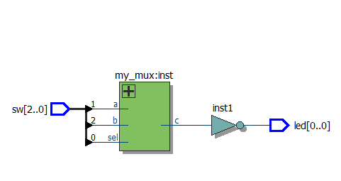
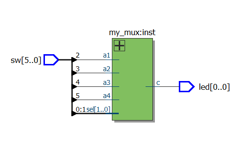
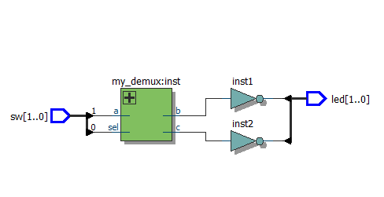

# 1-bit and 4-bit Full Adders / Одноразрядный и 4-разрядный сумматоры

This project contains Verilog modules implementing:
- A 1-bit full adder (`summ`)
- A 4-bit full adder built by chaining four 1-bit adders (`summ1`)

💡 The modules use basic logic gates (`&`, `|`, `^`) and demonstrate hierarchical instantiation.

📎 RTL View is included for 4-bit schematic.

---

## Features

- ✅ Modular design
- ✅ Fully testable on FPGA
- ✅ Two implementation methods: schematic + RTL-based
- ✅ Simulation-ready

## 📘 Описание на русском

Проект содержит:
- Одноразрядный полный сумматор (`summ`)
- 4-разрядный сумматор на основе иерархии (`summ1`)

📎 Диаграммы RTL и тестирование на ПЛИС выполнены.

