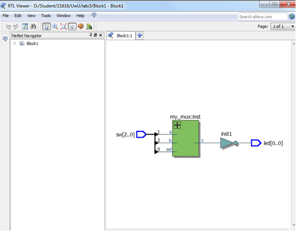
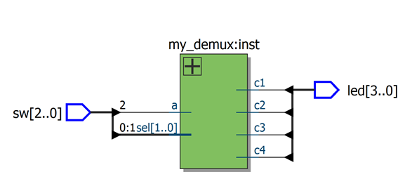

# Multiplexer & Demultiplexer Modules / Мультиплексоры и Демультиплексоры

This project includes Verilog modules implementing:
- 2-input MUX using logic ops
- 2-input MUX using ternary op
- 4-input MUX using case logic
- 2-output DEMUX
- 4-output DEMUX

---

## 🔧 Features

- ✨ Clean separation of logic
- 🧠 Useful for teaching and synthesis
- 🧪 Tested on FPGA (with test tables included)

## Files

- `mux_2bit_logic.v`
- `mux_2bit_ternary.v`
- `demux_2bit.v`
- `mux_4bit.v`
- `demux_4bit.v`

---

## 📘 Описание на русском

Проект включает модули:
- Мультиплексоры на 2 и 4 входа
- Демультиплексоры на 2 и 4 выхода
- Разные методы описания: логические и тернарные операторы
- Модули прошиты на ПЛИС и проверены

